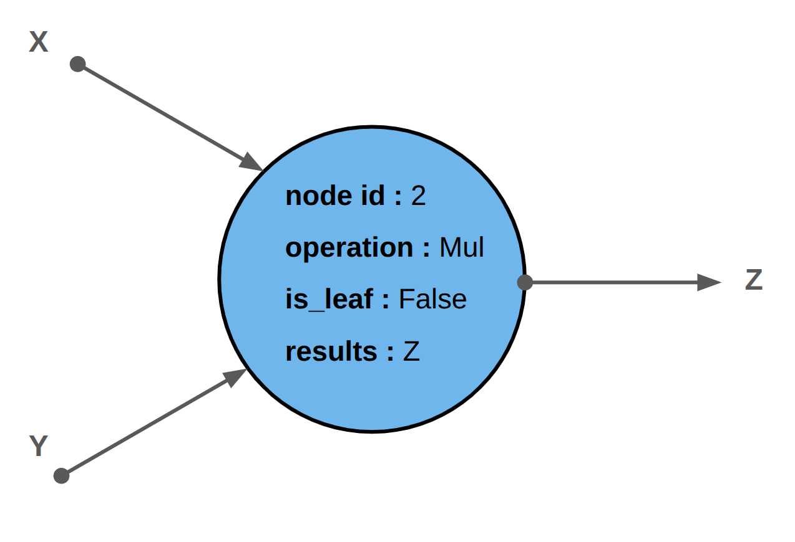
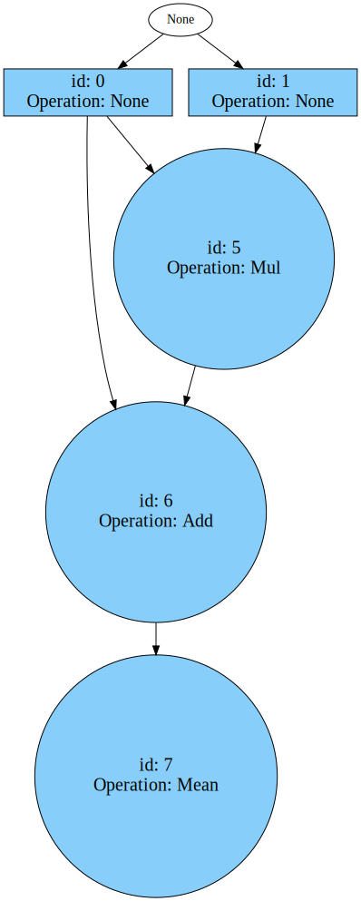
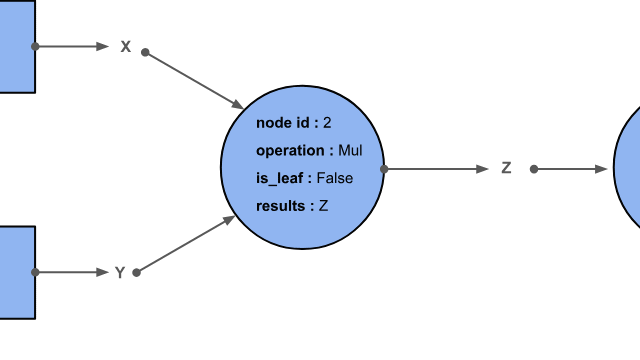

# Automatic differentiation made EaZy

"What I cannot create, I do not understand", Richard Feynman. I am starting this blog post with a Feynman quote, first and foremost to sound clever, but also because it summarizes well the purpose of EaZyGrad: understanding automatic differentiation at a fundamental level by rebuilding it. Not just a vague idea such as "it is related to the chain rule somehow", but a useful and reliable mental model of what PyTorch does under the hood when the almighty `.backward()` is invoked on a tensor.

We will use a simple example throughout this blog post:

```python
import eazygrad as ez

x = ez.tensor([1.0, 2.0, 3.0], requires_grad=True)
y = ez.tensor([0.5, -1.0, 4.0], requires_grad=True)

z = x * y
w = z + x
loss = w.mean()

print(loss)
loss.backward()

print(x.grad)
print(y.grad)
```

This tiny program already contains some of the core features of a proper deep learning library:
- operations on tensors,
- a reduction to a scalar loss,
- and finally a backward pass that propagates gradients back to the **leaf tensors** `x` and `y`.

## The Computation Graph

Leaf tensor is an important concept in an auto-diff engine. To understand it, we first need to explore the concept of a **computation graph**. At its core, a computation graph is simply a directed graph that records how a value was produced. Each node represents a value, typically a tensor, and each edge represents an operation that transforms one or more inputs into an output. Instead of thinking in terms of “running code line by line”, you can think of the program as building a graph of dependencies between values. Every time you apply an operation such as addition, multiplication, exponentiation, and so on, EaZyGrad creates a corresponding node behind the scenes.

Each node:
- stores the result of the operation,
- keeps references to the parent nodes, its inputs,
- and remembers how it was computed, that is, the operation.



There are three kinds of nodes:
- **leaf nodes** do not have parent nodes, but they do have children nodes. In the example above, `x` and `y` are leaf nodes because they are not the result of any computation.
- **root nodes** are the exact opposite. They have parent nodes, but no children. In our example, `loss` is the root node. Backward computation often starts from a scalar root node to produce the gradient that will be backpropagated.
- **intermediate nodes** sit in the middle. They have both parents and children. In our example, `z` and `w` are intermediate nodes.

As a more practical example, when training a neural network, the weights are leaf tensors, the layer activations are intermediate tensors, and the loss is usually the root tensor. Understanding this distinction is important to build a solid mental model of PyTorch. For instance, consider the following PyTorch code:

```python
import torch

a = torch.tensor([1.0, 3.0, 5.0, 7.0], requires_grad=True).reshape(2, 2)
b = torch.tensor([0.5, -1.0], requires_grad=True)

c = a + b
loss = c.mean()
loss.backward()

print(a.grad)
```

One might expect `a.grad` to contain the gradient of the tensor `a`. However, `a` is not a leaf tensor: it is the result of a computation, namely `reshape`, which makes it an intermediate tensor. By default, PyTorch frees intermediate gradients after the backward pass. Assuming that `a.grad` exists would therefore lead to a potentially sneaky bug. EaZyGrad also clears intermediate gradients in the computation graph after the backward pass to save memory. You can see that directly in the tensor operators. Side note: PyTorch exposes the `retain_grad()` method to prevent intermediate gradient clearing when needed.

Let us now walk through the code of our earlier example, starting with the base `_Tensor` class, which is essentially a wrapper around a NumPy array. NumPy takes care of the numerical computation, such as addition and multiplication, while EaZyGrad tracks the operations and builds the corresponding computation graph. Here is the `_Tensor` class in a nutshell:

```python
class _Tensor:
    def __init__(self, array, requires_grad, dtype=None):
        self._array = check.input_array_type(array, dtype)
        self.ndim = self._array.ndim
        self.dtype = self._array.dtype

        if requires_grad and not np.issubdtype(self.dtype, np.floating):
            raise TypeError("Only tensors with floating point dtype can require gradients.")

        self.requires_grad = requires_grad and dag.grad_enable
        self.grad = None
        self.acc_grad = np.float32(0.0)
        self.node_id = None
```

There are a few important design choices hidden in these few lines.

First, the actual numerical payload lives in `self._array`, which is just a NumPy array. EaZyGrad does not try to reinvent a numerical kernel library. It delegates the heavy lifting to NumPy and focuses on graph construction and gradient propagation.

Second, `requires_grad` determines whether the tensor participates in the computation graph. If it is `False`, the tensor behaves like a plain value container. If it is `True`, subsequent operations involving that tensor will create graph nodes and record enough information to differentiate later.

Third, there are two gradient-related attributes:
- `grad` stores the gradient that the user ultimately cares about, for example the gradient of the loss with respect to a model parameter,
- `acc_grad` is an internal buffer used while gradients are being propagated backward through the graph.

Finally, `node_id` links the tensor to the node in the computation graph that created it. Leaf tensors start with `node_id = None` and receive a proper node id when they are registered in the graph. Intermediate tensors are created by operations such as `+` and `*`, which immediately allocate a new node and assign that id to the resulting tensor.

Common arithmetic operations are overridden to add computation tracking and build the graph. For instance, the `__add__` implementation below is a `_Tensor` method which computes the result tensor and, if gradients are required, asks the global graph `dag` to create a node:

```python
def __add__(self, other: _Tensor | float | int) -> _Tensor:
    """
        Overload the '+' operator in python for the _Tensor class.
    """
    ...
    result = _Tensor(self._array + other._array, requires_grad=requires_grad)
    if requires_grad:
        result.node_id = dag.create_node(
            parents_id=[self.node_id, other.node_id],
            operation=operations.Add(),
            result=result,
        )
    return result
```

The graph itself stores that information in a compact node structure:

```python
class Node:
    def __init__(self, parents_id, operation, result, is_leaf=False):
        self.parents_id = parents_id
        self.operation = operation
        self.result = result
        self.is_leaf = is_leaf

class ComputationGraph:

	def __init__(self) -> None:
		# the computation graph
		# map between node_id and list(parent_id)
		self.dag = {}
		# node id
		self.node_count = -1
		# map between node_id and node
		self.node_map = {}
    
    def _register_node(self, node_id: int, parents_id: list[int | None]) -> None:
		# key : resulting node id
		# values : parents nodes
		self.dag[node_id] = parents_id

    def create_node(self, parents_id: list[int | None], operation: Any, result: Any, is_leaf: bool = False) -> int | None:
		if not self.grad_enable:
			return None
		# Increase node counter for id
		self.node_count += 1
		# Instantiate node
		node = Node(parents_id, operation, result, is_leaf)
		# Store node in a global map 
		self.node_map[self.node_count] = node
		# Register the node in the computation graph
		self._register_node(self.node_count, parents_id)
		return self.node_count
```

Each intermediate tensor gets a `node_id`, which is simply the current `node_count`, that points to the operation that produced it. In other words, the tensor carries a pointer into the computation graph through the `node_map` variable.

Leaf tensors such as `x` and `y` are also registered, but with `is_leaf=True` and no associated operation. They are the endpoints where gradients are accumulated for the user.

By the end of the forward pass, you have essentially built a fully traceable history of the computation, structured as a graph, like a recording tape. The DAG can be plotted for inspection in EaZyGrad:

```python
loss.plot_dag()
```



This renders the graph rooted at `loss`. For our example, the graph contains leaf nodes for `x` and `y`, then a multiplication node for `z = x * y`, then an addition node for `w = z + x`, and finally a mean reduction for `loss`. Visualizing the graph is useful because it makes reverse-mode differentiation feel much less magical: `.backward()` is simply a traversal of that recorded structure.

(sec-backward)=
## Playing the tape backward

Right now, we know how the computation graph is created during the forward pass. Let us now walk this process backward. The recording tape analogy was actually not an analogy, but a keyword. PyTorch’s autograd engine implements what is called **tape-based reverse mode automatic differentiation**. Operations recorded on the tape during the forward pass can be replayed in reverse order when computing gradients, starting from the root node and traversing the graph backward in topological order, that is, each node is visited only after all its children have been visited. Calling `.backward()` on the root tensor fires up this process:

```python
def backward(self, vector: np.ndarray | None = None, retain_graph: bool = False) -> None:
    if vector is None:
        self.acc_grad = np.float32(1.0)
    else:
        self.acc_grad = vector
    dag.backward(self.node_id, retain_graph=retain_graph)
```

That method on the tensor is intentionally very small. Its job is only to seed the gradient at the root and delegate the real work to the computation graph. If the output is a scalar loss, the seed gradient is `1.0`, because:

$$
\frac{\partial L}{\partial L} = 1
$$

The graph then walks backward:


```python
def backward(self, root_node_id: int, retain_graph: bool = False) -> None:
    pending_nodes = []
    heapq.heappush(pending_nodes, -root_node_id)
    while pending_nodes:
        current_node_id = -heapq.heappop(pending_nodes)
        current_node = self.node_map[current_node_id]
        if not current_node.is_leaf:
            grads_inputs = current_node.operation.backward(current_node.result.acc_grad)
            ...
            for parent_id, grad in zip(parent_nodes_id, grads_inputs):
                parent = self.node_map[parent_id]
                grad = ez.check.broadcasted_shape(grad, parent.result)
                parent.result.grad += grad
                parent.result.acc_grad += grad
```

Conceptually, each step does three things:

1. takes the gradient that has reached the current node (or **upstream gradient**),
2. applies the local backward rule of the recorded operation using VJPs, see {ref}`sec-vjp`,
3. sends the resulting gradients to the parent nodes (or **outgoing gradient**).

This is why the operation object is stored during the forward pass. It has stored the context of computation, and therefore knows how to transform an incoming gradient at the output into outgoing gradients for each input. As we will see in section {ref}`sec-vjp`, each operation implements its own local backward rule.


## Computing gradients along the way

Let us pause for a minute to summarize what we discussed so far. During the forward pass, each operation performed on tensors is recorded into a computation graph, or a tape. Each node memorizes the context of its creation, namely the input tensors, the operation, and the result, so that the tape can later be played backward. During the backward pass, we start from the root node, usually a scalar loss, and traverse the graph in reverse, applying each operation’s local transformation rule to propagate gradients back to the leaf tensors, where they can then be used by an optimization procedure such as stochastic gradient descent.

The only missing puzzle piece is this: how do we transform an incoming upstream gradient from a child node into outgoing gradients for the parent nodes, based on the operation recorded at the current node? This is the mathematically heavy part, so strap in.

Let us go back to our running example:

$$
z = x \odot y,
\qquad
w = z + x,
\qquad
L = \mathrm{mean}(w)
$$

where $\odot$ denotes element-wise multiplication. Written component-wise, this becomes:

$$
z_i = x_i y_i,
\qquad
w_i = z_i + x_i = x_i y_i + x_i
$$

and

$$
L = \frac{1}{n} \sum_{i=1}^{n} w_i
$$

The graph makes the dependency structure explicit:
- the mean node sends a gradient to \(w\),
- the addition node sends gradients to both \(z\) and \(x\),
- the multiplication node sends gradients to \(x\) and \(y\).

So for $x_i$, the gradient comes from **two paths**:
1. the direct path $x \to w \to L$,
2. the multiplication path $x \to z \to w \to L$.

Starting from the loss, we first have:

$$
\frac{\partial L}{\partial w_i} = \frac{1}{n}
$$

Then the addition node gives:

$$
\frac{\partial L}{\partial z_i} = \frac{\partial L}{\partial w_i} = \frac{1}{n}
\qquad\text{and}\qquad
\left.\frac{\partial L}{\partial x_i}\right|_{\text{through add}} = \frac{\partial L}{\partial w_i} = \frac{1}{n}
$$

Next, the multiplication node gives:

$$
\left.\frac{\partial L}{\partial x_i}\right|_{\text{through mul}}
=
\frac{\partial L}{\partial z_i}
\frac{\partial z_i}{\partial x_i}
=
\frac{1}{n} y_i
$$

and

$$
\frac{\partial L}{\partial y_i}
=
\frac{\partial L}{\partial z_i}
\frac{\partial z_i}{\partial y_i}
=
\frac{1}{n} x_i
$$

Since $x_i$ receives contributions from both paths, they must be added together:

$$
\frac{\partial L}{\partial x_i}
=
\left.\frac{\partial L}{\partial x_i}\right|_{\text{through add}}
+
\left.\frac{\partial L}{\partial x_i}\right|_{\text{through mul}}
=
\frac{1}{n} + \frac{1}{n} y_i
=
\frac{1}{n}(y_i + 1)
$$

So the final gradients are:

$$
\frac{\partial L}{\partial x_i} = \frac{1}{n}(y_i + 1)
\qquad\text{and}\qquad
\frac{\partial L}{\partial y_i} = \frac{1}{n}x_i
$$

For our concrete values

$$
x = [1, 2, 3], \qquad y = [0.5, -1, 4]
$$

we obtain:

$$
\nabla_x L = \frac{1}{3}[1.5, 0, 5] = \left[0.5, 0, \frac{5}{3}\right]
$$

and

$$
\nabla_y L = \frac{1}{3}[1, 2, 3] = \left[\frac{1}{3}, \frac{2}{3}, 1\right]
$$

That is the math you can derive with a pen and paper. Now here comes the million dollar implementation question : how do we compute these gradients efficiently for large tensor programs? Well, this is where Vector-Jacobian products enter the chat.

(sec-vjp)=
## Vector-Jacobian Products



Now is the time to talk about the core feature of tape-based reverse mode auto-diff engines: **vector-Jacobian products**.

A naive implementation of the chain rule would construct the full Jacobian matrix for every operation and multiply it by the incoming gradient. However, this is almost always wasteful.

If an operation maps \(\mathbb{R}^m \to \mathbb{R}^n\), its Jacobian has shape \(n \times m\). In deep learning, these matrices are often enormous, and we rarely need them explicitly. For element-wise operations, Jacobians are diagonal and mostly filled with zeros.

In practice, we are not interested in the full Jacobian. We only need its action on an incoming vector. This leads to the concept of **vector-Jacobian products (VJPs)**.

If an operation is

$$
f : \mathbb{R}^m \to \mathbb{R}^n
$$

with Jacobian

$$
J_f \in \mathbb{R}^{n \times m},
$$

and an upstream gradient

$$
v = \frac{\partial L}{\partial f},
$$

then what we compute is:

$$
v J_f
$$

For a composition \(L(f(x))\), the chain rule gives:

$$
\frac{\partial L}{\partial x}
=
\frac{\partial L}{\partial f}
\cdot
\frac{\partial f}{\partial x}
$$

Here:
- \(\frac{\partial L}{\partial f} = v\) is the upstream gradient,
- \(\frac{\partial f}{\partial x} = J_f\) is the Jacobian.

So the VJP \(v J_f\) is exactly how the chain rule is applied locally. But once again the product $v J_f$ is **not computed explicitely**. Since $J_f$ will always have the same structure, no matter the inputs, for a specific operation, we can derive and hardcode by hand a closed-form equation evaluated at runtime, and avoid to compute the expensive Jacobian $J_f$. Backpropagation is simply the repeated application of these operation's specific formulas while traversing the computation graph backward. Lets derive one of such VJP to let this concept sink in.

---

## Deriving the VJP for Element-Wise Multiplication

In our running example, the multiplication node is

$$
z = x \odot y
$$

where $x, y, z \in \mathbb{R}^n$, and component-wise:

$$
z_i = x_i y_i
$$

---

### Step 1 : Jacobian Structure

We begin by asking how each output component depends on each input component:

$$
\frac{\partial z_i}{\partial x_j}
$$

Since the multiplication is element-wise, each output $z_i$ depends only on $x_i$, not on $x_j$ for $j \ne i$. Therefore:

$$
\frac{\partial z_i}{\partial x_j} =
\begin{cases}
y_i & \text{if } i = j \\
0 & \text{otherwise}
\end{cases}
$$

Thus, the Jacobian of \(z\) with respect to \(x\) is diagonal:

$$
J_{z \to x} =
\begin{bmatrix}
y_1 & 0 & \cdots & 0 \\
0 & y_2 & \cdots & 0 \\
\vdots & & \ddots & \vdots \\
0 & 0 & \cdots & y_n
\end{bmatrix}
$$

Similarly:

$$
J_{z \to y} = \operatorname{diag}(x_1, x_2, \dots, x_n)
$$

---

### Step 2 : Chain Rule Application

Now suppose this multiplication node sits inside a larger computation graph, and we receive an upstream gradient:

$$
v = \frac{\partial L}{\partial z}
$$

The chain rule tells us how to propagate this gradient to the inputs:

$$
\frac{\partial L}{\partial x}
=
\frac{\partial L}{\partial z}
\cdot
\frac{\partial z}{\partial x}
=
v J_{z \to x}
$$

This is exactly the vector-Jacobian product.

---

### Step 3 : Efficient VJP Computation

Multiplying a vector by a diagonal matrix simply scales each component independently:

$$
(v J_{z \to x})_i = v_i y_i
$$

So we get:

$$
\frac{\partial L}{\partial x} = v \odot y
$$

And similarly:

$$
\frac{\partial L}{\partial y} = v \odot x
$$

---

### Final VJP Rule

$$
\operatorname{VJP}_{\text{mul}}(v, x, y)
= (v \odot y,\; v \odot x)
$$

In practice, EaZyGrad implements a VJP for each primitive operations (or computation nodes) : add, mul, matmul, exp, log etc. 

```python
class Operation:
    def __init__(self, **kwargs):
        self.context = kwargs
        for ctx in self.context.values():
            if isinstance(ctx, np.ndarray):
                ctx.flags.writeable = False

    def backward(self, grad_output):
        raise NotImplementedError


class Add(Operation):
    def backward(self, grad_output):
        return (grad_output, grad_output)


class Mul(Operation):
    def backward(self, grad_output):
        if "scalar" in self.context:
            scalar = self.context["scalar"]
            return (scalar * grad_output,)

        arr1 = self.context["arr1"]
        arr2 = self.context["arr2"]
        return (arr2 * grad_output, arr1 * grad_output)
```

This code captures the core idea behind backpropagation in EaZyGrad.

Every primitive operation is represented by a small `Operation` object with a single responsibility: given an incoming upstream gradient `grad_output`, compute the outgoing gradients for its inputs.

The constructor stores the **context** needed for the backward pass. For multiplication, this means keeping the original input arrays `arr1` and `arr2`, because the local derivatives depend on them:

$$
\frac{\partial (x \odot y)}{\partial x} = y
\qquad\text{and}\qquad
\frac{\partial (x \odot y)}{\partial y} = x
$$

This is why the forward pass must save some data. Once the actual numerical result has been computed, we still need enough information to differentiate that operation later. That saved information is exactly what autograd frameworks call the **context**.

Notice also that saved NumPy arrays are marked as non-writeable:

```python
ctx.flags.writeable = False
```

This is a defensive measure. If the saved context were modified in-place after the forward pass, the backward formulas could silently use corrupted values and produce wrong gradients. By freezing the arrays, EaZyGrad protects the integrity of the recorded tape.

The `Add` operation is almost trivial. Since

$$
\frac{\partial (x + y)}{\partial x} = 1
\qquad\text{and}\qquad
\frac{\partial (x + y)}{\partial y} = 1
$$

the upstream gradient is simply passed through to both inputs unchanged.

The `Mul` operation is only slightly more interesting. It implements exactly the VJP we derived above:

$$
\operatorname{VJP}_{\text{mul}}(v, x, y) = (v \odot y,\; v \odot x)
$$

There is also a special case for scalar multiplication. If the forward computation was `x * c`, then:

$$
\frac{\partial (x c)}{\partial x} = c
$$

so the backward rule reduces to:

$$
\frac{\partial L}{\partial x} = c \cdot \frac{\partial L}{\partial (x c)}
$$

This same pattern repeats for every primitive in the library. Each operation stores just enough context during the forward pass, and later exposes a `backward(...)` method that computes the local VJP for that operation.

That is exactly what each `operation.backward(...)` method in EaZyGrad computes . It takes the upstream gradient stored in `result.acc_grad` and returns the VJP for each parent (recall {ref}`sec-backward`). The engine then accumulates those gradients and continues walking backward.
More complex operation are interpreted as the composition of multiple primitive operations, such as the mean-squared error operation. In this case, it will chain multiple nodes (substraction $\to$ squarring $\to$ mean reduction), each with its own defined VJP. Side-note : instead of composing multiple nodes, one can always **fuse these operations** into a single node by defining a custom VJP. Reducing the number of function call can bring speed up at the cost of a more complex code-base.

---

## TL;DR summary in a nutshell for dummies

There are two key takeaways here.

First, the VJP is not a separate concept from the chain rule. It *is* the chain rule, written in a way that is efficient for vector-valued functions.

Second, we never build the Jacobian explicitly. We only use its structure to compute its effect on the incoming gradient.

A useful intuition to keep in mind is:

> Each node receives a gradient from its children, applies the chain rule locally, and sends transformed gradients to its parents.

---

**The computation graph stores the structure of the function, and VJPs are how the chain rule is executed along that structure during backpropagation.**

## Side note : Eager mode

EaZyGrad uses an **eager** execution model, which applies operations and builds the graph on the fly. In other words, the graph is dynamic and follows the flow of the program. This is flexible, conceptually simple, and very useful because it makes the extremely effective `print("here")` strategy work when debugging a tensor program. But it is also a significant waste of computing resources:
- it requires rebuilding the graph each time,
- operations are executed as they occur, so no optimization can be done by reordering or fusing them,
- and last but not least, it introduces a large Python overhead.
This is why modern Auto-differentiation libraries such as JAX and Tinygrad use Just-in time (JIT) compilation where the graph is created once to trace the flow of computation, optimized by fusing ops or removing python overhead, and then reused for each backward/forward pass. Since Pytorch 2.0, it is possible to use torch.compile to JIT-compile pytorch code. 